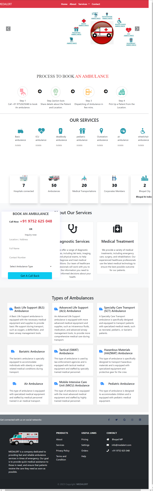
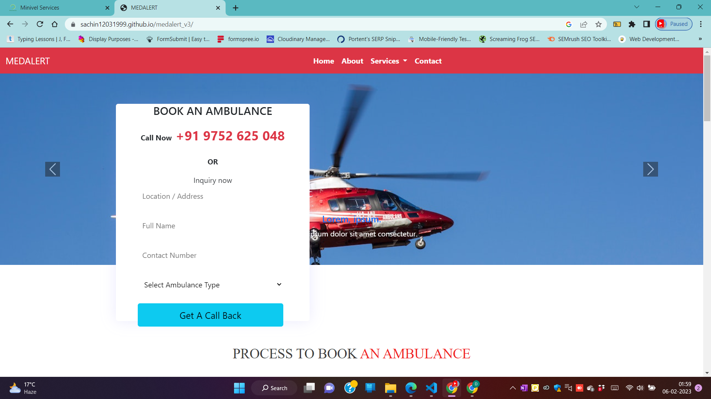

# MedAlert

MedAlert is a premier provider of ambulance services, offering a wide range of emergency medical transportation options to meet the needs of patients and healthcare providers. Our services are designed to provide quick, efficient and safe transportation to those in need of medical attention. 

## Project Completion

The project was completed under the supervision of Abhiyantriki Technology in Bhopal, Madhya Pradesh. 

### Team Members

- Developer:  [Gourav Mahobe](https://github.com/grv24)
- GitHub URL: https://github.com/grv24
- QA Tester: [Angesh Mishra](https://github.com/angesh27)
- GitHub URL: https://github.com/angesh27
- Designer: Sachin Pandey

- Company: [Abhiyantriki Technology](https://www.abhiyantrikitech.com) , Bhopal MP

- With our more team members of Abhiyantriki Technology and Medalert team
- Company URL: https://www.abhiyantrikitech.com
- Github gnerated page URL :https://sachin12031999.github.io/medalert/ 
- Live project URL : https://medalertlife.com/

### Abhiyantriki Technology

For more information on Abhiyantriki Technology, please visit their website at: https://www.abhiyantrikitech.com

## Features

- 24/7 availability
- Fleet of well-equipped ambulances
- Trained and experienced medical staff
- Advanced life support equipment 
- Comfortable and spacious vehicles
- Competitive pricing

## Services

- Basic Life Support Ambulance
- Advanced Life Support Ambulance
- Bariatric Ambulance
- Pediatric Ambulance
- Non-Emergency Medical Transportation
- Inter-Facility Transfers
- Stretcher Transport Services

## Why Choose MedAlert?

At MedAlert, patient care is our top priority. Our team of highly trained and experienced medical professionals are dedicated to providing the best possible care to each and every patient. We use only the latest and most advanced medical equipment to ensure a safe and comfortable transport experience.

In addition to our commitment to patient care, MedAlert is also known for our competitive pricing and 24/7 availability. We understand the urgency of medical emergencies and strive to provide prompt and reliable service to all of our patients.

## Screenshots

## Contact Us

For more information about MedAlert and our ambulance services, please visit our website at https://sachin12031999.github.io/medalert/  

